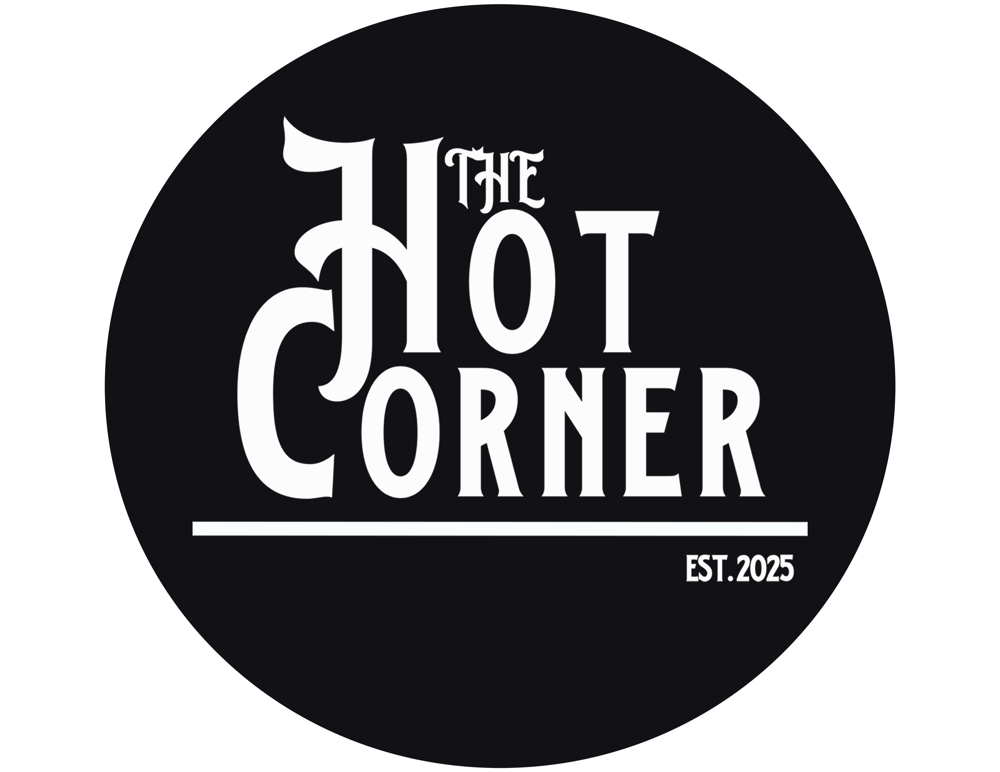

<!DOCTYPE html>
<html lang="en">
<head>
    <meta charset="UTF-8">
    <meta name="viewport" content="width=device-width, initial-scale=1.0">
    <title>The Hot Corner</title>
    
</head>
<body>

<header>
    
    <h1>Welcome to The Hot Corner</h1>
    
"The Next Closest Place to Home"

</header>

    <section class="description">
        <h2>About The Hot Corner</h2>
        
The Hot Corner is a 100-year-old farmhouse located just steps away from the Cooperstown Dreams Park. Perfect for baseball families, this cozy home offers comfort, convenience, and a true upstate New York experience. The main house features 4 bedrooms, 2.5 bathrooms, and sleeps up to 10 guests. An additional cabin on the property is available for rent, accommodating 4 more guests.

    </section>

    <section class="amenities">
        <h2>Amenities</h2>
        <ul>
            <li>Free Wi-Fi</li>
            <li>70" HDTV with Roku</li>
            <li>Fully-equipped kitchen</li>
            <li>Outdoor fire pit and BBQ grill</li>
            <li>Crib, stroller, and high chair available</li>
            <li>Free parking (8 spaces)</li>
        </ul>
    </section>

    <section class="local-attractions">
        <h2>Local Attractions</h2>
        <ul>
            <li>National Baseball Hall of Fame (10-minute drive)</li>
            <li>Farmers' Museum and Fenimore Art Museum</li>
            <li>Glimmerglass State Park</li>
            <li>Fly Creek Cider Mill</li>
        </ul>
    </section>

    <section class="photo-gallery">
        <h2>Photo Gallery</h2>
        
        
        
        
        
        
        
        
        
        
        
        
        
        
    </section>

    

        <a href="https://www.airbnb.com/rooms/1258924469478504080?guests=1&adults=1&s=67&unique_share_id=ce6115e4-ff88-41f2-8d7b-f8dae33b0901" target="_blank">Book Now on Airbnb</a>
    

<footer>
    
&copy; 2025 The Hot Corner | Cooperstown, NY

    
Email: <a href="mailto:upstateventuresllc@gmail.com">upstateventuresllc@gmail.com</a>

</footer>

</body>
</html>
